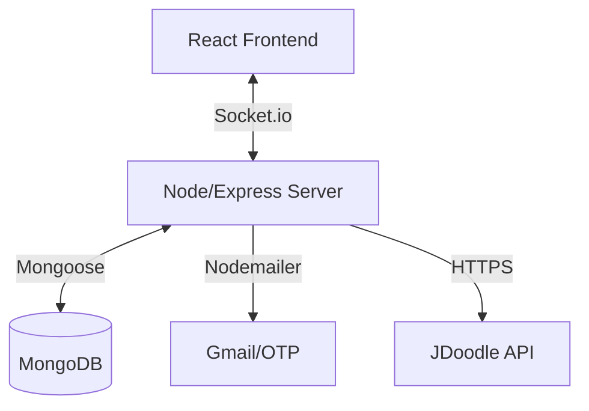

# ⚔️ Code Clash Backend

A real-time, competitive 1v1 coding platform where users can challenge each other to solve algorithmic problems.

## 🚀 Key Features

- **Real-time 1v1 Matches**: Powered by Socket.io for instant opponent matching and live updates.
- **Code Execution Engine**: Integrated with **JDoodle API** to run code in Python, Java, C++, C, and JavaScript.
- **ELO Rating System**: Automatic skill-based rankings updated after every match.
- **Secure Authentication**: JWT-based auth with HTTP-only cookies and **Email OTP verification**.
- **Live Chat**: Cleaned and sanitized real-time messaging between opponents.
- **Admin Dashboard**: Secure routes for admins to manage (CRUD) coding problems.
- **Security Hardened**: Protected against XSS, Clickjacking (Helmet.js), and Rate Limiting.

## 🛠️ Tech Stack

- **Server**: Node.js & Express.js
- **Database**: MongoDB (Mongoose)
- **Real-time**: Socket.io
- **Mailing**: Nodemailer
- **Authentication**: JWT & Bcrypt

## 📋 Prerequisites

- Node.js installed
- MongoDB (Local or Atlas)
- JDoodle API credentials
- Gmail App Password (for OTP emails)

## ⚙️ Installation

1. Clone the repository:
   ```bash
   git clone https://github.com/nikk151/Code-Clash.git
   cd Code-Clash
   ```

2. Install dependencies:
   ```bash
   npm install
   ```

3. Setup environment variables:
   Create a `.env` file in the root directory and add the variables listed in `.env.example`.

4. Start the server:
   ```bash
   # Development (with nodemon)
   npm run dev

   # Production
   npm start
   ```

## 🔐 Environment Variables

| Variable | Description |
|----------|-------------|
| `PORT` | Server port (default: 3000) |
| `MONGO_URI` | MongoDB connection string |
| `JWT_SECRET` | Secret key for signing tokens |
| `EMAIL_USER` | Gmail address for sending OTPs |
| `EMAIL_PASS` | Gmail App Password |
| `JDOODLE_CLIENT_ID` | JDoodle API Client ID |
| `JDOODLE_CLIENT_SECRET` | JDoodle API Client Secret |

## 🗺️ Project Architecture



## 🔑 API Endpoints (Quick Reference)

| Method | Endpoint | Description | Auth |
|--------|----------|-------------|------|
| POST | `/api/auth/send-otp` | Sends 6-digit OTP | No |
| POST | `/api/auth/register` | Finalize registration | No |
| POST | `/api/auth/login` | Login & set cookie | No |
| POST | `/api/match/create-match` | Start a new lobby | Yes |
| POST | `/api/match/submit-code/:code` | Submit solution | Yes |
| GET | `/api/leaderboard` | Top 50 rankings | No |

## 🛡️ Security Features

- **Input Sanitization**: All user descriptions and chat messages are sanitized via the `xss` library.
- **Rate Limiting**: Custom limits for general API and sensitive code execution endpoints.
- **Helmet**: Sets secure HTTP headers to prevent common web vulnerabilities.
- **CORS**: Configured to only allow requests from the trusted frontend origin.

---
Built with ❤️ by [nikk151](https://github.com/nikk151)